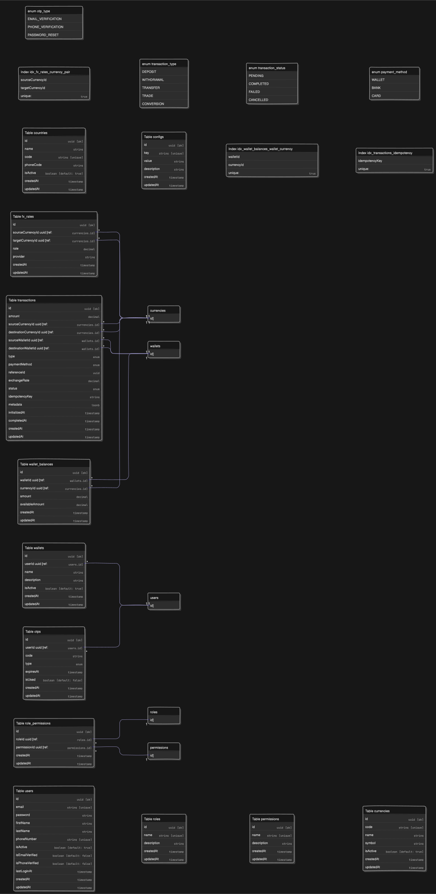

# Credpal FX Documentation

## Table of Contents


## Project Overview

Credpal FX is a foreign exchange (FX) trading platform built with NestJS. The platform enables users to perform currency exchange operations, manage wallets, and execute trades with real-time exchange rates.

## Setup Instructions

### Prerequisites

- Node.js v20.9.0 (as specified in .nvmrc)
- Docker and Docker Compose
- PostgreSQL
- Redis

### Environment Setup

1. Clone the repository
2. Install dependencies:
   ```bash
   npm install
   ```
3. Copy `.env.example` to `.env` and configure environment variables
4. Start the development environment:
   ```bash
   make up && make dev
   ```
5. Run database migrations:
   ```bash
   npm run migration:run
   ```

### Development Commands

- `make dev` - Start development server
- `make debug` - Start in debug mode
- `make up SERVICE=<service name>` - Start a service
- `make up` - Start all services
- `make down` - Stop all services
- `make clean` - Stop all services and remove containers, images, and volumes
- `make healthcheck` - Check service health

## Key Assumptions

1. Users must be authenticated to perform transactions
2. Exchange rates are fetched from external APIs
3. A user can only have one wallet and they can have different currencies(wallet balance) in their wallet
4. SMS OTP verification is required for sensitive operations. I had to remove the email verification because it was not working as expected, however, the email adapter is implemented in the `src/adapters/email/email.adapter.ts` file.
5. Real-time rate updates are handled through caching and the last as long as the next update is not due based on the next update time from the api call
5. The application is deployed in a containerized environment using Docker and Docker Compose with monitoring and tracing tools
6. When users signup, they are assigned the role of `user` that comes with default permissions, the default permission are found in the `src/shared/guards/enums/permission.enum.ts` file. However, they are supposed to be assigned the role by the admin

## Project Structure

```
src/
├── adapters/                  # External service adapters
│   ├── cache/                 # Redis cache implementation
│   ├── fxRates/               # FX rate provider adapters
│   ├── repositories/          # Database repositories
│   └── sms/                   # SMS service adapter
├── configs/                   # Configuration modules
│   ├── common.config.ts       # Common app configuration
│   └── typeorm.config.ts      # Database configuration
├── modules/                   # Feature modules
│   ├── auth/                  # Authentication & authorization
│   ├── core/                  # Core entities and services
│   │   ├── entities/          # Database entities
│   │   └── services/          # Core business logic
│   ├── country/               # Country management
│   ├── currency/              # Currency management
│   ├── otp/                   # OTP functionality
│   ├── trade/                 # FX trading functionality
│   ├── transaction/           # Transaction management
│   └── wallet/                # Wallet management
├── shared/                    # Shared utilities
│   ├── guards/                # Auth guards
│   ├── interceptors/          # HTTP interceptors
│   ├── observability/         # Logging & monitoring
│   └── utils/                 # Utility functions
├── app.controller.ts          # Main app controller
├── app.module.ts              # Root module
└── main.ts                    # Application entry point
```

## API Documentation

### Swagger Documentation

The API documentation is available at `http://<APP_HOSTNAME>:<APP_PORT>/<SWAGGER_API_ROOT>` when running the application, that would be `http://localhost:3005/api/docs` if you are running the application locally. It provides:

- Detailed endpoint descriptions
- Request/response schemas
- Authentication requirements
- Example requests

### Postman Collection

A Postman collection is available for testing the API endpoints and it contains all the endpoints that are available in the API as well as their response sample. [Click here to view the collection](https://lively-satellite-918268.postman.co/workspace/My-Workspace~8405603c-f87e-4c70-8aed-40798146b6c4/collection/33424447-d1c92d8a-df90-423d-844b-8745b89772f1?action=share&creator=33424447&active-environment=33424447-e65edbb2-a06f-4c5a-bc3f-2abb191ae7ba). It includes:

- Authentication flows
- Wallet operations
- Trading endpoints
- Transaction history
- Currency conversion

## Architectural Decisions

### Technology Stack

- **Backend**: NestJS (Node.js)
- **Database**: PostgreSQL
- **Cache**: Redis
- **Monitoring**: Prometheus, Grafana, Loki
- **Tracing**: OpenTelemetry

### Key Design Patterns

1. **CQRS**: For separating read and write operations
2. **Repository Pattern**: For database operations
3. **Unit of Work Pattern**: For database operations in a transaction
4. **Adapter Pattern**: For decoupling the application from external services

## Process Flows

### Authentication Flow

1. Client submits registration data
2. System validates input data
3. System checks if email/phone already exists
4. Password is hashed using bcrypt
5. User record is created
6. OTP is generated and sent via SMS
7. After successful OTP verification, the initial user wallet with the default currency of the user's country is created(This is achieved using the phone number)
8. Initial deposit transaction is created and processed
9. User's profile and token are returned

### Trading Flow

1. User authentication
2. Wallet balance check
3. Exchange rate fetch
4. Trade execution
5. Transaction recording
6. Balance updates

### Wallet Management Flow

1. User initiates a transaction (deposit/withdraw/exchange)
2. System validates user permissions and transaction parameters
3. Transaction is created with PENDING status
4. For currency exchanges, current FX rates are fetched from provider
5. Unit of Work ensures atomic transaction operations
6. Wallet balances are updated
7. Transaction status is updated to COMPLETED
8. Transaction details are returned to client

## Flow Charts

### Trading Process

[](https://mermaid.live/edit#pako:eNqFlF1zojAUhv9KJhe7N7YrwrqVi-4oYKtYatHuF3qRQlSmSNyQbNtF__uGBCjt2C0zMh7y5OQ957yTHIYkwtCEq4Q8hBtEGZjbixSIpx_MmIwpivASnJycg0H-DSVxhBgG_S3hKQPnoP31oPhBgew9sgdWMN9Q8gAGKPLxb44z5jyGeMdiki6b7E-c7YEdXGAGbjNMP2bgO0oSzErIlmc6cn1GOA0x-ADmiK5FbHFKcRrGOCthR8LDvE9xYxHY8WqFRcAqlcNa5cW7KofPKi-liuEP4Iviy-VLeeQosFAS8qRoSilO9aakRpIaF_s_WRQXWFnMACUoDatsY8m5Ta5M95JzJTfJrQ0O70H_D4oTdJfU2coyJ1L6KM34ahWLTqRsD67eLVjtmjX2eEGlhaI0Q2EBAx-HhEblHk_quW50wcMPlZpqOtcSmga3u-jNBijmpmKOFj-VjF8zDVHCrIxX590oTgW-DGaBjxmnqfKzqCHjSTUj9c743Zqi3QYsYHkqkMWL7AvYHNJYy19WAJzHOGNZ5bGxVpts3An-O_SOSqg3Tf4K0Z5dONabepUTXC1_2apXYtxnMW4t5rizlBhXiTmONMS4pRicRm90sTmeKSXCDlmcrqteKuN4WjDD7MgkTTB1PHvkXSybU_Tfxq3rq-nEmTv2stYFW3CL6RbFkbjh8uLzArIN3uIFNMXfCNH7Qs1BcIgzMntKQ2gyynELUsLXG2iuUJKJiEu_2TESpW3rrzuU_iJkW21Z0-Kcck3cORGmVnERQLPbkTA0c_gITU3XTrtGT9eNz0a3-8XoteATNPW2caqdGUZXPzO04ndowb8ye_tUQJ1e-6wn-E5b72otiKOYEXql7m55hR_-AeZlz-Q)

### Wallet Management

[](https://mermaid.live/edit#pako:eNp1lF2TmjAUhv9KJhftjeuIUKpctLMCKttqHXWnH-hFhKwwC4mThLpW_e8NgXTAqczAQM5zznnPC-EMIxpj6MCXjB6jBDEB1t6GAHk8hitRPo8LEoPvKMuw2IKHh09gFE6wAM8cs_dcB6qUkYq7Ku4WjGESncDuBFzZo0ZchXgKGf8ASyR0xFMRP3QZlotgzRDhKBIpJWCJI8rimvMVNz67CY5e6_5ghDJEIgz8t5QL_vlaodV1XCZcfmJ-AZPw-RCX1RWXkr1O3DbROb2AqdYxx8cbqLpOlIxAF2zKlb6Jgtf0tOKaqYFaeqpsVOlx28cnBXwJl1gUjOgZ3zWbtLTwYrdn6JCADWzqUBPImw1sOucb4UpWq0Q6YOHPvWA-aZnr9xUSkFSkKAMzLJBUiWoGk_hOc_0WZoigPc4xEbp15dbECAMSSVUcg8ecFkQPXIf7jfBvlGZol92AlZtTo6Xvf0R7gjvV7k_SspHmB-l_w8jqBQZtI91vs8VXf-172xbU11-IdhEcU5GABeXi5ruSamAH5pjlKI3lljyXyxsoEunkBjryNkbstdRwlRwqBF2dSAQdwQrcgYwW-wQ6Lyjj8qlQPb0UyYHyf6sHRH5RmuuUPSv71DG5WWPM3NId6NiWgqFzhm_QMUyja1tD07Q-WLb90Rp24Ak6Zs_qGgPLss2BZZTntQP_qOq9roT6w95gKPl-z7SNDsRxKiibVT8b9c-5_gWm0GEe)

### Currency Exchange
[](https://mermaid.live/edit#pako:eNqNlV1zojAUhv9KJhe7N7YrwrqVi-4oaIst1qrdL_QihahMMbFJ6Mei_31DAhZdZ7vO6BDPe3Ke8x4IGQxphKEN5wl9DpeICTBxpwTITzsYi3ztpIxhEr4Ch5InzHhMyQycnJyDTvYNJXGEBAbtFU2JAOeg_nWrszu5ZDOgG-AEkyWjz6CDohF-TDEX3ZcQr0W-T1X7E_MNcIMLLMAdx-wjB99RkmBRiFxVs6viY5qyEIMPYILYAu8QY8wLcVeJe1mb4UoQuPF8juVClJS9HeXFu5S9N8pLRdH7AUay-SJ8qUp6eeSTw3DuSoHZQQkiYanzlK5f1RVd7Ov6SneVOUscPoD2E4oTdJ_sdisauFJQHuHpfB7LHonYgOt3W9FZ40qOH5QsDBGOwlwMRjikLCpy9C9P7xcMrZdgCgsQ4COCFnglt5nCaoueke0bALovMRe89N4zduZ7jeCfljX0hmZ1-AcS4206nlkl1j72jWzf5QOY_htMfwdzfC4apq9hjksqMP0CBpOoSuWrTQbB3Vo9P0V-efsOVPSmjB7tWGuGpeYoyF8zq053yKisyGOyKOemoXwjGOc2CyRSboNhd-B6g4vZnqShJB6JRYwS4GOBJASaHW31RqXc7kArCLpGkTbUOr24VYuRPg1UYlTNLFJGSjUORlikjBzcuzxNxP_44NDVWh4z8rL0QRe_3ffBufGH191J153tiRplX6UJ4DkWSzCk_HAY0hZYgyvMViiO5Imb5X9PoVjKZ2cKbXkZIfaQM2ylDqWCjl9JCG3BUlyDjKaLJbTnKOFylaqaboxkQ6vdv2tEflG6KlMWLK9TxOSpF2Hm5Mc0tJtNJYZ2Bl-gbZjGadNqmab12Wo2v1itGnyFtlm3To0zy2qaZ5aRf7c1-FvtXj-VokarftaS-kbdbBo1iKNYUObrd4l6pWz_AAU4_Kw)

## Database ERD



## Endpoints

### Authentication

- `POST /auth/register` - Register a new user
- `POST /auth/verify` - Verify a user

### Wallet

- `GET /wallet` - Get user wallet
- `POST /wallet/fund` - Fund user wallet
- `POST /wallet/trade` - Withdraw from user wallet
- `POST /wallet/convert` - Convert currency

### Transaction

- `GET /transactions` - Get user transactions

### FX

- `GET /fx/rates` - Get FX rates

## Key Features

1. Multi-Currency Wallet System

- Support for multiple currencies per user
- Real-time balance tracking
- Transaction history

2. Foreign Exchange Operations

- Real-time currency conversion
- Dynamic exchange rates from external providers
- Exchange rate history tracking

3. Secure Authentication System

- JWT-based authentication
- OTP verification for sensitive operations
- Password hashing with bcrypt

4. Transaction Management

- Atomic transactions with rollback support
- Idempotent operation design
- Comprehensive transaction metadata

5. Role-Based Access Control

- Granular permission system
- Admin and user role separation
- Fine-grained API endpoint access control

6. Comprehensive Monitoring

- Prometheus metrics integration
- Distributed tracing
- Structured logging with Loki

7. Containerized Deployment

- Docker and Docker Compose support
- Environment-based configuration
- Easy local development setup

8.  Database Migration Support

- TypeORM migrations
- Data seeding for initial setup

## Architectural Diagram 
[](https://mermaid.live/edit#pako:eNp9VF2TmjAU_StMdqZPrMVPhIedUfzYbXW6XX0q9CFA1IyQMEnorlX_ey-fxVbNA5Nz78k9N-EkRxTwkCAbbSL-HuywUNp64jENhkz9rcDJTnMiSpha4AMRrocKpOXQQz8LbjZGbpkaJYks44SFHvun3Oj1paoF0yuFxm4Wn2NF3vGhEXdchzMleBQRcU9gnErKiJSVSoWvSE3cFRG_aEDkZ-f726qRmbqjECfqvtIEK1ypZPMrCjP3jSRcUsUFJbKRmLvZCh9L0gg-Azuk9yS_-RI6xj6NqDqA7JKzvDbbap-0Bd9uYXbRwIv7KnhM1I6kTfkv7oLvaSPw1V2TOOH_S4-0x8cnbVyAcQ6cAjg5KO0yycG0ANMczAowy8G8CZ5rWuvx6TT9gHNmONIcHEXypFUYbCBhi3U6w_Xeiu_FcRTVlkQJGkCZymg3mXBcQLuwy03uWmBwyenvL6__jDpEpHlHtA2NIvthY210CW7dE_uh2-02yVVjJdP3bzIveqsLD27R6-ZK6mBj3aJebrGgW8FFI0hHMRExpiG8D8dssYfARjHxkA3TEIu9hzx2Bh5OFV8dWIBsJVKiI8HT7Q7ZGxxJQGkSwmWeUAwWjutogtkPzuNqyVZkOmVOgP-IcHjKFLL7hpGzkX1EH8geWC3LGLYts9ttm-aw19HRAdntXr_V7ZjtTs9om9bQ7HTOOvqd1zdaw_5g0O73hoZlGobZH-gIbhncmmXx9uVP4PkPZlGQcw)

## Challenges

1. Email verification was not working as expected, so I had to replace it with SMS OTP verification
2. Extensive error handling and recoverywith third party services was not sufficiently implemented due to time constraints
3. The observability tools are not deployed in a containerized environment, so I had to use Docker Compose to run the infrastructure locally

## Areas for Improvement

1. Enhanced observability and alerting
2. Advanced trading features
3. Improved rate caching
4. Enhanced security measures
5. Better documentation
6. Automated testing
7. Extensive error handling and recovery with third party services
8. Rate limiting
9. More endpoints
10. Soak and load testing using grafana K6
11. Asynchronous processing of transfers with worker queue like BullMQ

## Conclusion

Credpal FX provides a robust platform for foreign exchange operations with a focus on security, reliability, and user experience. The architecture is designed for scalability and maintainability, with clear separation of concerns and modern development practices.

The platform continues to evolve with new features and improvements, maintaining a strong focus on security and performance while providing a seamless user experience.
